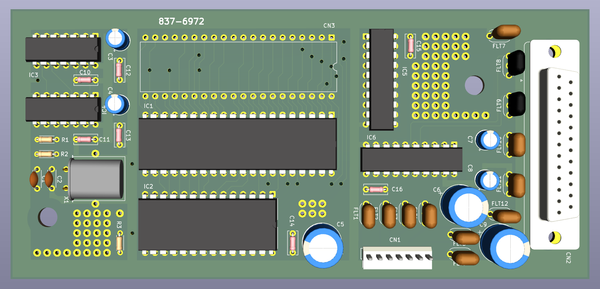

# Mega-Tech Daughter Board

This project contains a KiCad recreation of the Sega Mega-Tech daughter board, Sega part number 837-6972 on PCB 171-5796, intended to document the board layout, components, and interconnects in a form that is easier to inspect and preserve. It is useful both as a repair reference and as a starting point for further reverse-engineering of the Mega-Tech hardware.

## Bill of Materials

| Reference | Part |
| --- | --- |
| CN1 | JST NH 7P Conn Header B7P-SHF-1AA |
| CN2 | DB25 female connector |
| CN3 | 2x 20P pin headers 61303211221 / 146463 |
| C1 | 47pF ceramic disc capacitor |
| C2 | 47pF ceramic disc capacitor |
| C3 | 10uF 50V 85°C aluminum electrolytic capacitor |
| C4 | 10uF 50V 85°C aluminum electrolytic capacitor |
| C5 | 470uF 25V 85°C aluminum electrolytic capacitor |
| C6 | 470uF 25V 85°C aluminum electrolytic capacitor |
| C7 | 22uF 50V aluminum electrolytic capacitor |
| C8 | 22uF 50V aluminum electrolytic capacitor |
| C9 | 470uF 25V 85°C aluminum electrolytic capacitor |
| C10 | 22nF axial ceramic resistance capacitor |
| C11 | 22nF axial ceramic resistance capacitor |
| C12 | 22nF axial ceramic resistance capacitor |
| C13 | 22nF axial ceramic resistance capacitor |
| C14 | 22nF axial ceramic resistance capacitor |
| C15 | 22nF axial ceramic resistance capacitor |
| C16 | 22nF axial ceramic resistance capacitor |
| R1 | 1MΩ ±5% resistor (brown-black-green-gold) |
| R2 | 4.7kΩ ±5% resistor (yellow-violet-red-gold) |
| R3 | 4.7kΩ ±5% resistor (yellow-violet-red-gold) |
| IC1 | Z80 CPU running at 4 MHz (Z84C00 / Z80A family) |
| IC2 | NEC D71051C USART |
| IC3 | NEC D74HC393C |
| IC4 | Philips (NXP) PC74HC04P |
| IC5 | SEGA 315-5356 PAL16L8A |
| IC6 | NEC D4711AG parallel I/O |
| X1 | 4.9152 MHz crystal |
| FLT1 | 2.2nF 100V ceramic filter network |
| FLT2 | 2.2nF 100V ceramic filter network |
| FLT3 | 2.2nF 100V ceramic filter network |
| FLT4 | 2.2nF 100V ceramic filter network |
| FLT5 | 2.2nF 100V ceramic filter network |
| FLT6 | 2.2nF 100V ceramic filter network |
| FLT7 | 2.2n 100V ceramic filter network |
| FLT8 | 270pF feedthrough capacitor filter |
| FLT9 | 270pF feedthrough capacitor filter |
| FLT10 | 2.2nF 100V ceramic filter network |
| FLT11 | 2.2nF 100V ceramic filter network |
| FLT12 | 2.2nF 100V ceramic filter network |
