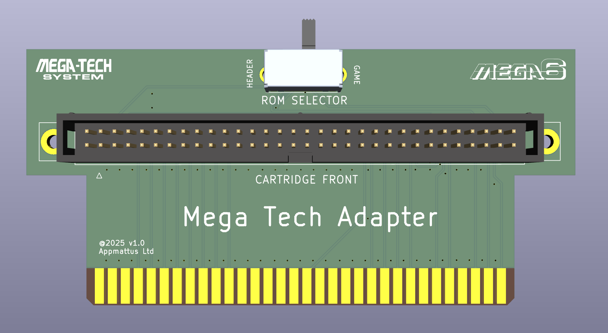

# MD Dumper Mega Tech Adapter

This adapter allows Sega Mega Tech cartridges to be read using the
[MD Dumper](https://github.com/X-death25/MD_Dumper).

It can be used to back up both the game ROM and the menu ROM from Mega Tech
carts. It also lets Mega Tech cartridges be played directly on a Mega Drive or
Mega Sg by switching between the game ROM and header ROM.

## Bill of Materials

| Part | Notes | Links |
|--|--|--|
| Alps Alpine Through Hole Slide Switch DPDT `SSSF121900` | ROM selector switch | [RS 123-8907](https://uk.rs-online.com/web/p/slide-switches/1238907) [Mouser 688-SSF121900](https://www.mouser.co.uk/ProductDetail/Alps-Alpine/SSSF121900) |
| Megadrive 64p cartridge slot | Cartridge connector | [AliExpress](https://www.aliexpress.com/item/1005009621566306.html) |

## Manufacturing

| Setting | Value |
|--|--|
| Layers | 2 |
| PCB thickness | 1.6mm |
| Surface finish | ENIG |
| Gold thickness | 1U" |
| Gold fingers | Yes |
| Mark on PCB | Order Number (Specify Position) |
