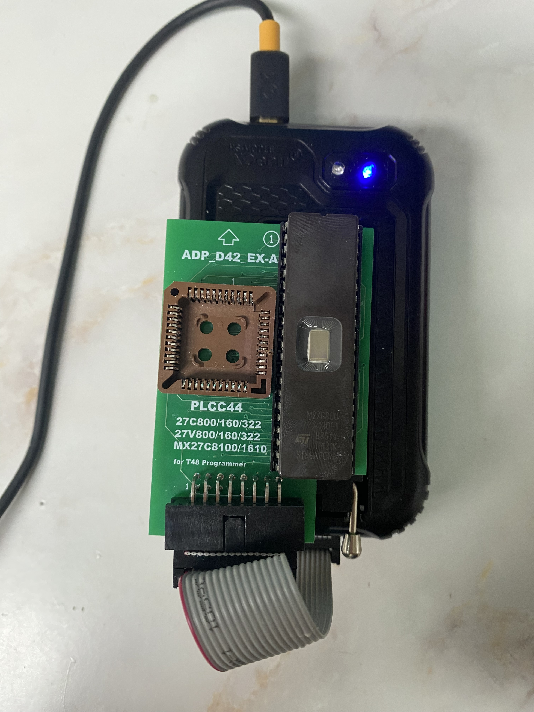
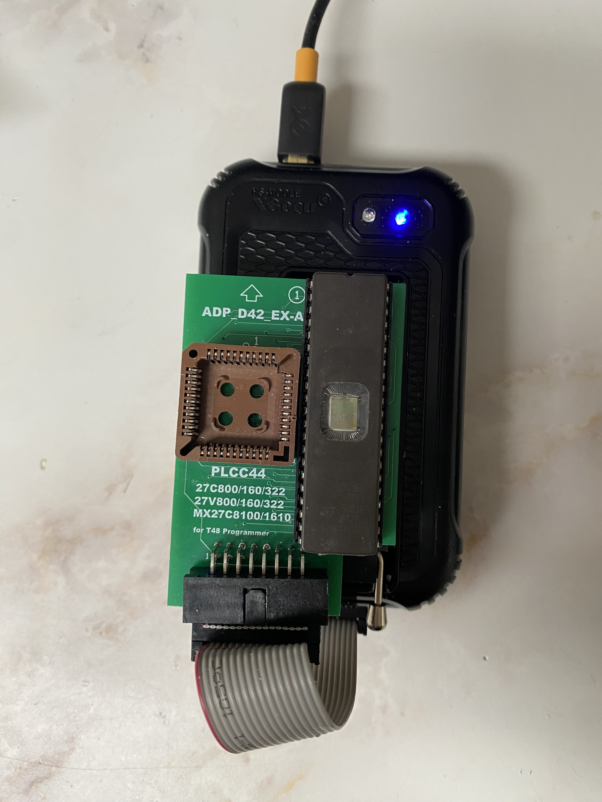
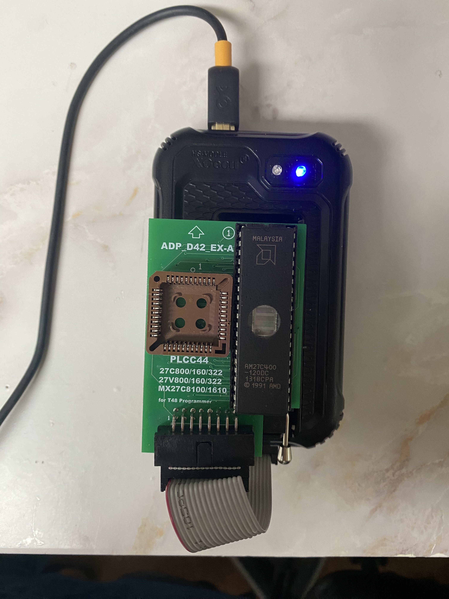
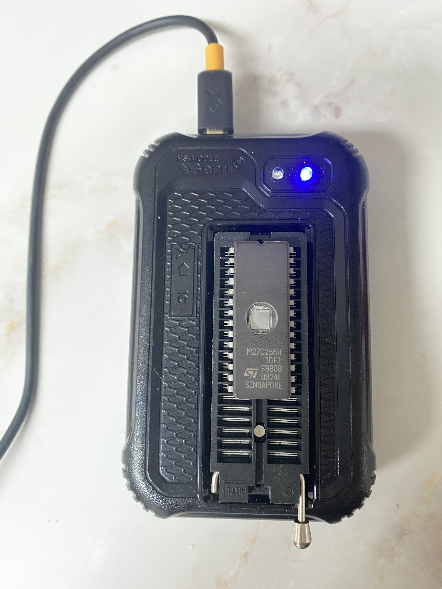

# Writing cartridges

A reproduction Sega Mega Tech cartridge PCB design, including Gerbers for
fabrication, is available from https://github.com/mourix/Mega-Tech-Cartridges.

## Game ROMs

### Verify correct byte-order

When viewing the game ROM files in a HexEditor, ensure the text appears swapped, i.e. the header should read as 
`ESAGM GE ARDVI E` and NOT `SEGA MEGADRIVE`.

ROM files can be reversed with the `romrev.sh` script:

`./romrev.sh file.ic1`

### Combine multi-game ROM files

Some games for the Sega Mega Tech and Sega Mega Play come as split ROMs. The `romcom.sh` script can be used to
interleave these files into a single ROM file that can be written as below.

`./romcom.sh file.ic1 file.ic2`

### 1MB game ROM files

Use a 27C800 chip with the ADP_D42_EX-A adapter in the XGecu T48 programmer; there will be no empty pins.



To verify it is blank

```bash
minipro -p M27C800@DIP42 --blank_check
```

To write a ROM file

```bash
> minipro -p M27C800@DIP42 -y -w rom.bin
```

### 2MB game ROM files

Use a 27C160 chip with the ADP_D42_EX-A adapter in the XGecu T48 programmer; there are no gaps in the adapter.



To verify it is blank

```bash
minipro --device M27C160@DIP42 --skip_id --blank_check
```

To write a ROM file

```bash
minipro -p M27C160@DIP42 -y -w rom.bin
```

### 512k game ROM files

Use a 27C400 chip with the ADP_D42_EX-A adapter in the XGecu T48 programmer, and place the chip with one pin empty at the top.



To verify it is blank

```bash
> minipro --device HN27C4000G@DIP40 --skip_id --blank_check
```

To write a ROM file

```bash
> minipro -p HN27C4000G@DIP40 -y -w rom.bin
```

## Menu ROMs

### 32k menu ROM files

Use a M27C256B chip directly in the XGecu T48 programmer. Insert as denoted on the device.



To verify it is blank

```bash
> minipro --device 'M27C256B@DIP28' --skip_id --blank_check
```

To write a ROM file

```bash
> minipro -p M27C256B@DIP28 -y -w rom.bin
```
